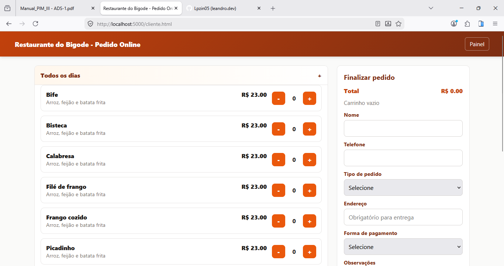
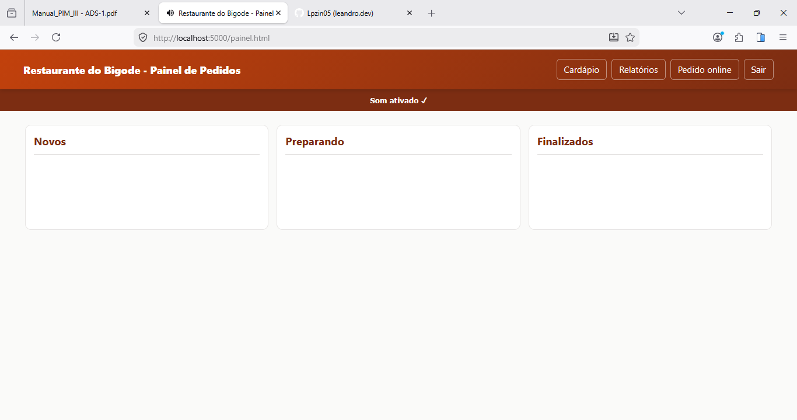
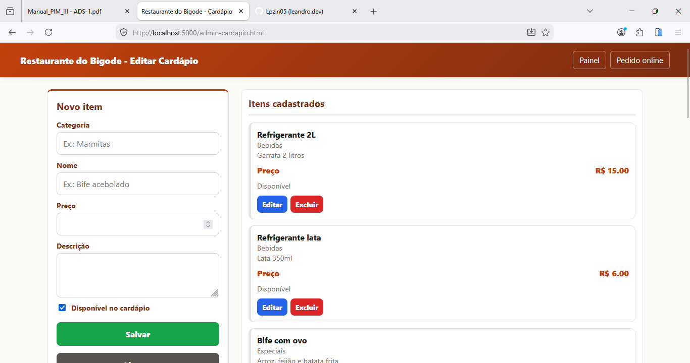
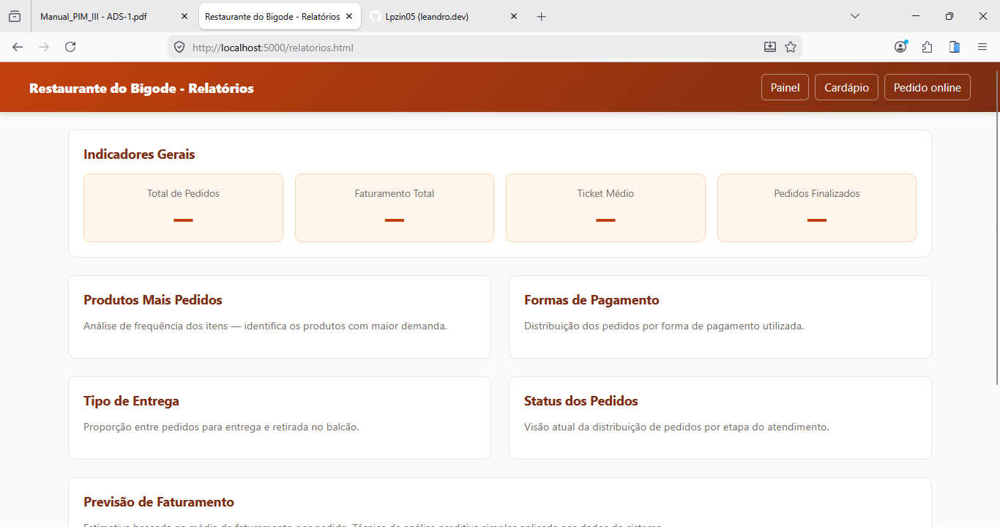

# 🍽️ Restaurante do Bigode — Sistema de Pedidos Online


> Projeto acadêmico desenvolvido para o **PIM III** — Projeto Integrado Multidisciplinar do Curso Superior de Tecnologia em Análise e Desenvolvimento de Sistemas da **UNIP (Universidade Paulista)**.

Sistema web completo para gerenciamento de pedidos de um restaurante fictício, integrando conceitos de **Engenharia de Software Ágil**, **Programação Orientada a Objetos com C#**, **Banco de Dados**, **Desenvolvimento Web Responsivo**, **UX/UI Design** e **Análise de Dados**.

---

## 📸 Telas do Sistema

### 🛒 Pedido Online — Tela do Cliente


### 🎛️ Painel de Pedidos — Área Administrativa


### 🍴 Gerenciamento do Cardápio


### 📊 Relatórios e Análise de Dados


---

## ✅ Funcionalidades

**Área do Cliente**
- Cardápio organizado por categorias com acordeão interativo
- Adição e remoção de itens com controle de quantidade
- Carrinho com total em tempo real
- Pedido com entrega ou retirada, escolha de pagamento e observações
- Layout responsivo para celular, tablet e desktop

**Área Administrativa**
- Login seguro com autenticação por sessão (cookie)
- Painel Kanban com pedidos por status (Novo / Preparando / Finalizado)
- Atualização automática a cada 5 segundos
- Alerta sonoro ao receber novos pedidos
- Gerenciamento completo do cardápio (criar, editar, ocultar, excluir)
- Relatórios com indicadores, rankings e previsão de faturamento

---

## 🛠️ Tecnologias Utilizadas

| Camada | Tecnologia |
|--------|-----------|
| Backend | ASP.NET Core 8 / C# |
| Paradigma | Programação Orientada a Objetos |
| Banco de Dados | SQLite (Microsoft.Data.Sqlite) |
| Frontend | HTML5, CSS3, JavaScript (Vanilla) |
| Responsividade | CSS Grid + Media Queries |
| Autenticação | Cookie Authentication |
| Arquitetura | API REST + Repositório |

---

## 🏗️ Arquitetura do Projeto

```
restaurante-bigode/
│
├── Program.cs                      # Ponto de entrada e rotas da API REST
├── RestaurantOrderSystem.csproj    # Configuração do projeto .NET
│
├── Models/                         # Entidades do domínio (POO)
│   ├── Pessoa.cs                   # Classe abstrata base (herança)
│   ├── Cliente.cs                  # Herda de Pessoa
│   ├── Pedido.cs                   # Agrega Cliente e ItemPedido
│   ├── ItemPedido.cs               # Item com subtotal encapsulado
│   ├── ProdutoCardapio.cs          # Produto disponível no cardápio
│   ├── StatusPedido.cs             # Enum: Novo, Preparando, Finalizado
│   ├── TipoEntrega.cs              # Enum: Entrega, Retirada
│   └── FormaPagamento.cs           # Enum: Pix, Dinheiro, Cartão
│
├── Repositories/                   # Camada de acesso ao banco de dados
│   ├── ICardapioRepository.cs      # Interface (polimorfismo)
│   ├── IPedidoRepository.cs        # Interface (polimorfismo)
│   ├── SqliteCardapioRepository.cs # Implementação com SQLite
│   └── SqlitePedidoRepository.cs   # Implementação com SQLite
│
├── Dtos/                           # Objetos de transferência de dados
│   └── PedidoDtos.cs
│
├── database/                       # Inicialização do banco de dados
│   └── DatabaseInitializer.cs      # Cria tabelas e cardápio inicial
│
└── wwwroot/                        # Frontend estático
    ├── cliente.html / cliente.js   # Tela do cliente
    ├── admin.html / admin.js       # Login do administrador
    ├── painel.html / painel.js     # Painel de pedidos
    ├── admin-cardapio.html / .js   # Gerenciamento do cardápio
    ├── relatorios.html / .js       # Relatórios e análise de dados
    ├── styles.css                  # Estilos globais responsivos
    └── favicon.svg                 # Ícone do sistema
```

---

## 🚀 Como Rodar Localmente

**Pré-requisito:** [.NET 8 SDK](https://dotnet.microsoft.com/download)

```bash
# 1. Clone o repositório
git clone https://github.com/Lpzin05/restaurante-bigode.git
cd restaurante-bigode

# 2. Instale as dependências
dotnet restore

# 3. Execute o projeto
dotnet run
```

| Tela | URL |
|------|-----|
| Pedido Online | http://localhost:5000/cliente.html |
| Login Admin | http://localhost:5000/admin.html |
| Painel | http://localhost:5000/painel.html |
| Cardápio | http://localhost:5000/admin-cardapio.html |
| Relatórios | http://localhost:5000/relatorios.html |

> **Credenciais:** usuário `admin` / senha `admin123`

---

## 🗄️ Banco de Dados

O SQLite cria o arquivo `restaurante-bigode.db` automaticamente na primeira execução com tabelas e cardápio inicial já populados.

| Tabela | Descrição |
|--------|-----------|
| `Cardapio` | Produtos com categoria, preço e disponibilidade |
| `Pedidos` | Dados do cliente, tipo de entrega e status |
| `ItensPedido` | Itens vinculados ao pedido (FK → Pedidos) |

---

## 📊 Conceitos de POO Aplicados

| Conceito | Onde é aplicado |
|----------|----------------|
| **Herança** | `Cliente` herda de `Pessoa` |
| **Encapsulamento** | `Pedido` com `private set` e lista interna protegida |
| **Polimorfismo** | Interfaces `ICardapioRepository` e `IPedidoRepository` |
| **Abstração** | Classe abstrata `Pessoa` |

---

## 👥 Integrantes do Grupo

|    Nome   |     RA     |
|-----------|------------|
| Leandro   | R10474 — 5 |
| Gabriel   |            |
| Lucas     | R8514H — 1 |
| Guilherme |            |


---

## 📚 Disciplinas Integradas — PIM III

- Engenharia de Software Ágil Aplicada
- Modelagem de Banco de Dados e NoSQL
- Programação Orientada a Objetos com C#
- Desenvolvimento Web Responsivo
- UX e UI Design
- Machine Learning e Análise de Dados
- Comunicação, Liderança e Negociação
- Língua Brasileira de Sinais (LIBRAS)

---

## 🎓 Informações Acadêmicas

| | |
|-|-|
| **Instituição** | Universidade Paulista — UNIP |
| **Curso** | CST em Análise e Desenvolvimento de Sistemas |
| **Projeto** | PIM III — Projeto Integrado Multidisciplinar |
| **Ano** | 2026 |
